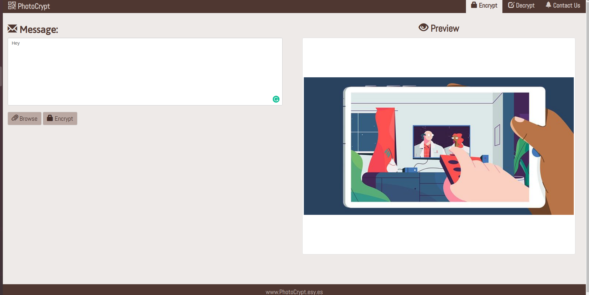

# PhotoCrypt
> Image Steganography in javascript using JS


## Features

- Hide text in Images using LSB Steganography
- All Text is encrypted using AES
- Easily Deployable using Nodejs and Heroku
- Try it Here - https://photocrypt-237.herokuapp.com/encrypt



## Installation

```sh
npm install 
npm start 
```


## Meta

Nishay Madhani  – nshmadhani@gmail.com

Distributed under the XYZ license. See ``LICENSE`` for more information.

[https://github.com/nshamdhani](https://github.com/nshmadhani/)

## Contributing

1. Fork it
2. Create your feature branch (`git checkout -b feature/fooBar`)
3. Commit your changes (`git commit -am 'Add some fooBar'`)
4. Push to the branch (`git push origin feature/fooBar`)
5. Create a new Pull Request

<!-- Markdown link & img dfn's -->
[npm-image]: https://img.shields.io/npm/v/datadog-metrics.svg?style=flat-square
[npm-url]: https://npmjs.org/package/datadog-metrics
[npm-downloads]: https://img.shields.io/npm/dm/datadog-metrics.svg?style=flat-square
[travis-image]: https://img.shields.io/travis/dbader/node-datadog-metrics/master.svg?style=flat-square
[travis-url]: https://travis-ci.org/dbader/node-datadog-metrics
[wiki]: https://github.com/yourname/yourproject/wiki
